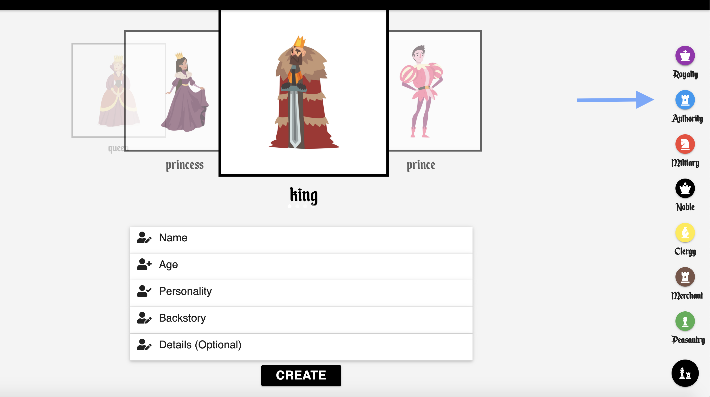
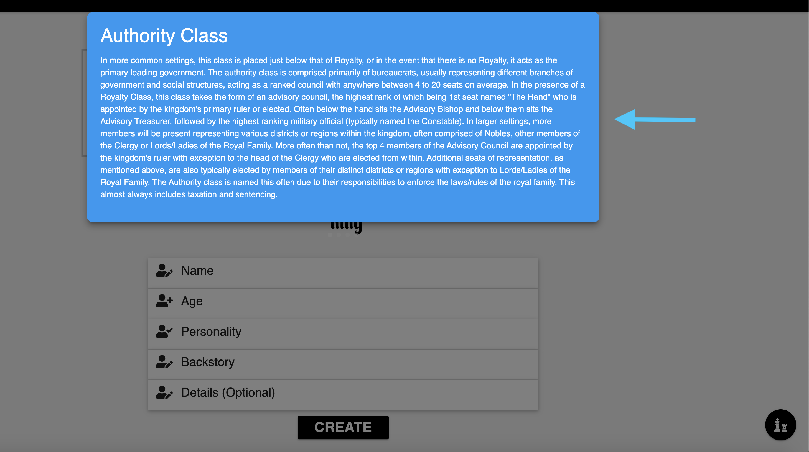
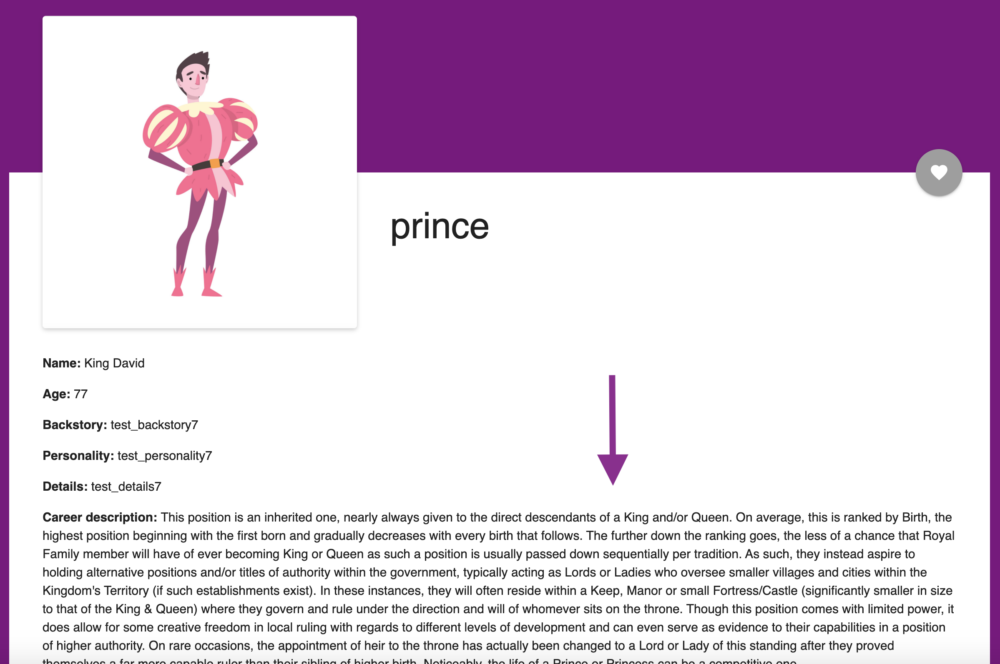

# MedievalAvatars

This application is a Medieval NPC (Non-Playable Character) generator for tabletop and board games. It allows the user to create and store a large number of characters occupying different aspects of a medieval society, divided up by social classes and their individual careers. It is a helpful tool for world building with a medieval themed setting and useful in creating multiple characters and storing them for later use. The motivation behind this application is the fact that similar applications are poorly made and there is a growing market for the tabletop culture. We also thought it was an application that will highlight our creativity and originality.

# Installation

To install this application you need to follow these steps:

* Step 1: Visit Github repository at [Github](https://github.com/orenamema/MedievalAvatars)
* Step 2: Clone repository (selecting clone button and copy link)
* Step 3: Open Terminal (or Git Bash for Windows users) in the location you wish to copy the app files to
(I personally use Desktop)
* Step 4: Type git clone (adding copied link here without parentheses)
* Step 5: Once created, direct the terminal within the file (or reopen it within) and perform an npm install
(this will grab the needed node_module files)
* Step 6: Next locate the schema.sql file from within the models folder
* Step 7: Open the file and copy its contents
* Step 8: Open MySQL Workbench or similar database program
* Step 9: Paste the sql copied content within and run it to establish your databse.
* Step 10: Run a local server (typing node server.js) and Enjoy!

# Instant Use

Alternatively to have instant access to the application without installing it, simply visit the [Medieval Avatars](https://radiant-plateau-35150.herokuapp.com/) site. We have used [Heroku](https://www.heroku.com) to host our site.

# Instructions of use

As a New User, first begin by creating a username and password. Both are needed to create and save any characters. Once made, login and make your way to the Create page (if not already there upon login). Here you will see a black bar along the top of the screen displaying various Social Classes of the middle ages such as Royal, Peasantry, etc. To read about each social class, there is a black round button on the bottom right of the screen. Simply hovering over it and selecting the matching Social Class will display some general info about each (some more detailed than others).

When selecting different Social Classes, you'll notice that a carousel of images will also change, displaying different character types, each representing a different Career of that particular Social Class. For example: within the Royal class you'll find a King and Queen. Within the Peasantry Class you'll find Farmers and Hunters. The center image represents the current selected Career. To create this into a Character (aka Avatar), follow these simple steps:
* 1) create a name
* 2) include an age
* 3) select any personality traits
    - no limit to the number you may choose
    - positive traits check as green
    - negative traits check as red
* 4) write the character's backstory
    - this can be any length
* 5) (optional) write additonal Details about the character.

    Once complete, simply press select and you'll be taken to the View Own page. To navigate the app, select the three line symobol in the top left corner of the screen (resembling a flattened cheese burger). This will open the Sidenav bar which is present on every page. To close this bar, simply click anywhere on the browser.

On the View Own page, you (the user) may view all of the character's you've created. In the event that you've made MANY, they can be viewed based on Social Class. Similar to the Black bar on the Create page, this black bar will display different Careers for each social class but these will consist only of your personally made characters. To view characters made by others, visit the View All page which will display avatars created by other users. On this page, when viewing a character made by someone else, you have the option to copy it and obtain it for yourself. Other users can also copy characters you have made.

Within the description of each created Avatar, you'll notice it includes not just the information you added but also information for the chosen Career. These descriptions are unique to each of the current 35 available Careers, some featuring more info than others (see example of descriptions below).

## Technology Used

* [MySQL](https://www.npmjs.com/package/mysql)
* [InquirerJs](https://www.npmjs.com/package/inquirer/v/0.2.3)
* [Nodejs](https://nodejs.org/en/)
* [Express-Handlebars](https://www.npmjs.com/package/express-handlebars)
* [Express](https://www.npmjs.com/package/express)
* [JQuery](https://www.npmjs.com/package/jquery)
* [Heroku](https://www.heroku.com)
* [Javascript](https://www.w3schools.com/js)
* [FontAwesome](https://fontawesome.com/)

## Application

## Code

## Learning Points

## Authors

**Casey Moldavon**

* [Github](https://github.com/casey-moldavon)
* [LinkedIn](https://www.linkedin.com/in/casey-moldavon-442a1761/)
* [Portfolio](https://casey-moldavon.github.io/updated-portfolio-page/)

**Oren Amema**

* [Github](https://github.com/orenamema)
* [LinkedIn](https://www.linkedin.com/in/oren-amematekpo-b7a12b13)
* [Portfolio](https://orenamema.github.io/UpdatedPortfolio/)

**Ken Bains**

* [Github](https://github.com/ken_bains)
* [LinkedIn]
* [Portfolio]

